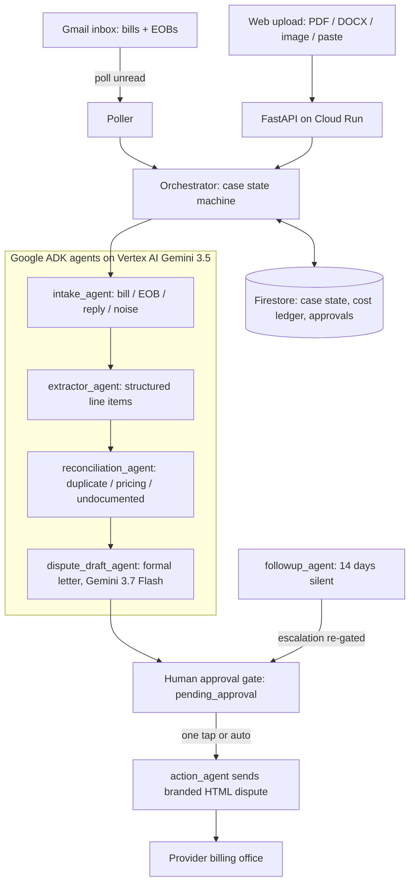

# CleanBill

**The AI billing advocate that lives in your inbox.** ClearBill watches for hospital
bills and insurance EOBs, cross-references them, catches overcharges, writes the
formal dispute letter, asks you with one tap, sends it — and follows up if the
provider goes silent.

Built for the *All Things Agentic* hackathon (Taskmaster category: a complete
multi-step background workflow, not a chatbot).

## Architecture



**One email, one case.** Every state transition is one structured log line
(`case_id`, `agent`, `from_state`, `to_state`), and every LLM calls token usage is
written to the case cost ledger in Firestore — real per-agent cost accounting, not
estimates.

## The workflow

1. **Intake** — each inbound email is classified: bill, EOB, provider reply, or noise.
2. **Wait for the pair** — a bill parks in `awaiting_docs` until its matching EOB
   arrives (patient + provider match, punctuation-insensitive); either arrival order works.
3. **Extract** — Pydantic-schema-enforced structured extraction of line items, codes,
   amounts. The billing contact email is copied verbatim, never inferred — a wrong
   value misdelivers a legal letter.
4. **Reconcile** — flags duplicate charges, pricing mismatches, and undocumented
   charges above a named confidence threshold.
5. **Draft** — a formal dispute letter naming every flagged line item (Gemini 3.7 Flash).
6. **Gate** — the case sits in `pending_approval` until a human flips it in the web
   UI. No code path sends without that flip recorded in Firestore.
7. **Send + follow up** — branded HTML dispute email to the bill billing-contact
   address; if no reply lands within 14 days, an escalation draft re-enters the gate.

## Tech stack

- **Google ADK** — agent roster (`clearbill/agents.py`), thin orchestrator
- **Vertex AI Gemini 3.5 Flash** for extraction/reconciliation, **3.7 Flash** for
  drafting (all models satisfy the Gemini 3.5+ mandate; a true 3.5+ Pro does not
  exist on Vertex yet — `config.py` notes where to restore one)
- **Firestore** — case store: hash-keyed idempotency, state machine, cost ledger
- **Cloud Run** — hosts the web UI and API (`--min-instances=0`)
- **FastAPI + vanilla JS** — web app; upload PDF/DOCX/images or paste text
- **Gmail API** — inbox poll + dispute delivery

## Try it

**Hosted:** https://clearbill-512401546414.us-central1.run.app — upload a bill + EOB,
review the flagged discrepancies and drafted letter, press *Send dispute email*.
(The deployed send needs the operator local OAuth for delivery, so it returns a
clear 503 there; run locally for a full send.)

**Locally:**

```bash
pip install -r requirements.txt
gcloud auth application-default login \
  --scopes=https://www.googleapis.com/auth/cloud-platform,https://www.googleapis.com/auth/gmail.modify,https://www.googleapis.com/auth/gmail.send
export GOOGLE_CLOUD_PROJECT=your-project-id
export DEMO_RECIPIENT=you@example.com   # fallback recipient when a bill shows no billing email
uvicorn main:app --port 8080
```

- Web app: `http://localhost:8080` — upload or paste, review, send.
- Mail mode: forward a bill (subject containing *invoice* or *statement*) to
  yourself; the poller picks it up within ~2 minutes. EOB-gated: no dispute is
  written until the matching EOB arrives.
- Deploy: `gcloud run deploy clearbill --source . --region us-central1 --min-instances 0`

## Tests

```bash
python3 -m pytest tests/test_auto_send.py tests/test_gate.py tests/test_idempotency.py  # offline + Firestore
python3 -m pytest tests/test_live_pipeline.py    # live Vertex: schema extraction, planted duplicate
python3 -m pytest tests/test_e2e_resume.py       # kill/restart, EOB pairing, gate, escalation
```

Full end-to-end validation (5 bill+EOB pairs x local Gmail and Cloud Run, planted
duplicate / mismatch / undocumented errors, dispute emails verified in the recipient
inbox): **[docs/TEST_REPORT.md](docs/TEST_REPORT.md)**

## Deployed

https://clearbill-512401546414.us-central1.run.app (min-instances=0)

## Known limits (deliberate)

- Personal-Gmail ingest/send runs locally under the operator OAuth; Cloud Run cannot
  touch a personal mailbox without Workspace domain-wide delegation. Upgrade when the
  watched inbox is a Workspace account.
- Follow-ups run on an interval check, not push scheduling — sufficient for a
  14-day window.
